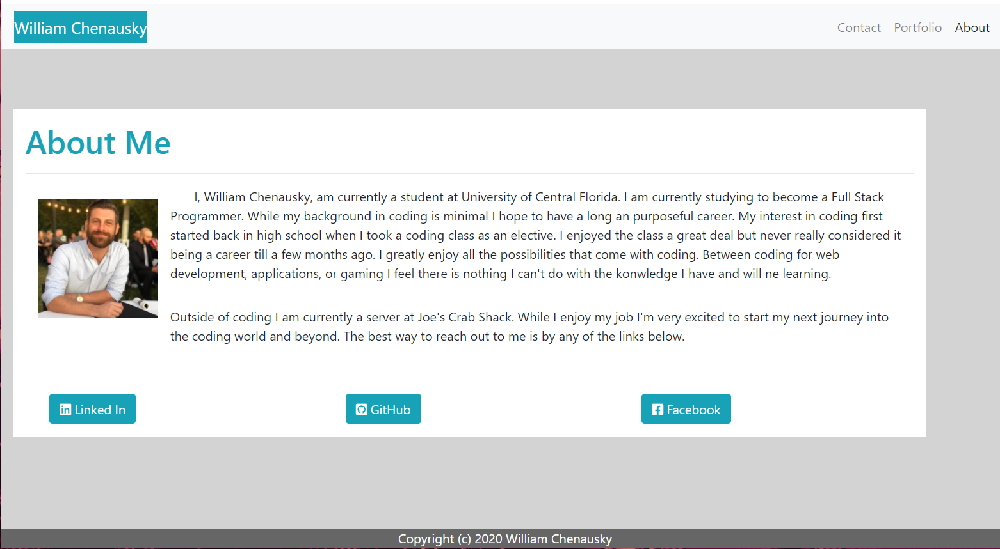
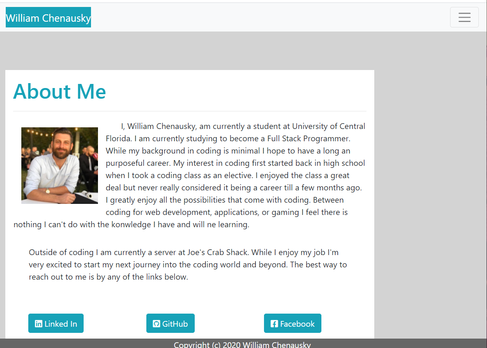
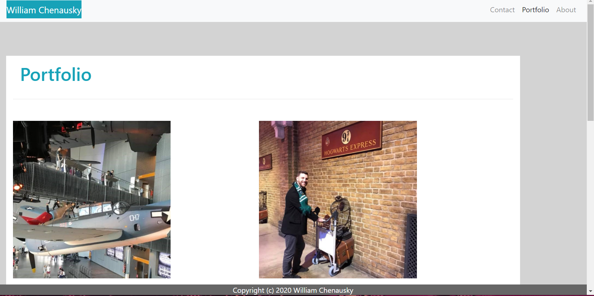
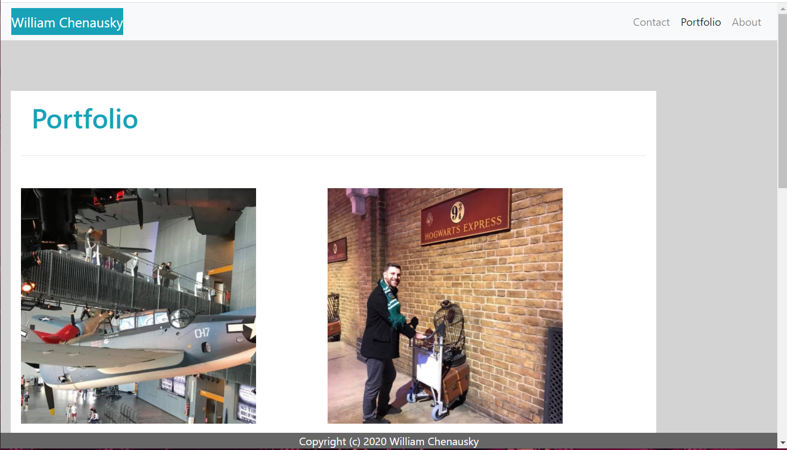
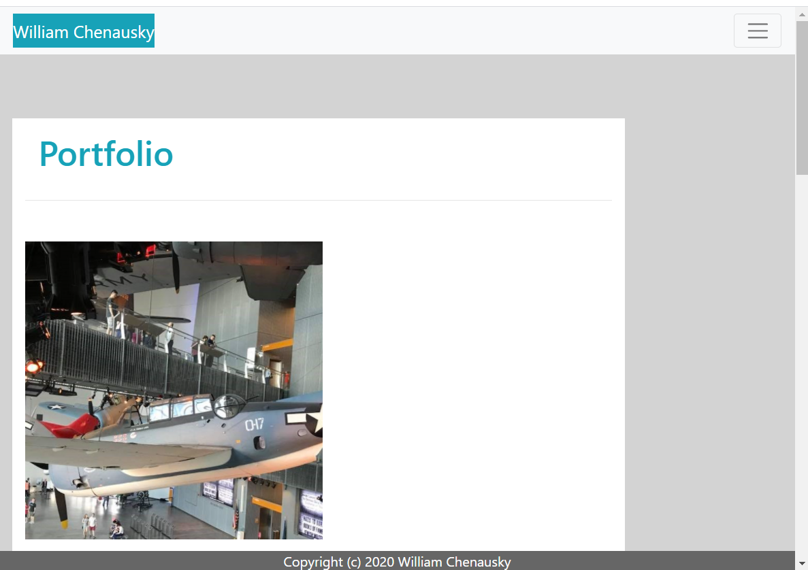

# Responsive Portfolio

In this exersise I have started to learn and put to use, Bootstrap. The purpose of this exercize is help me better understand the functions of Boot strap and it's almost limitless possibilites. I've learned things such as, rows and colums, how to use buttons, inserting pictures and linking individual pages and websites. I really enjoyed the process and can't wait to learn more as I progress in my coding career.

## Table of Contents

## Add Bootstrap Reference Links

1. Add Bootstrap Reference Links for CSS and JavaScript from (www.getbootstrap.com)

## Create a Responsive About Me Page

1. Use Bootsrap to create the About me web page.

  

  

## Create a Responsive Portfolio Page

1. Use Bootstrap to create the Portfolio web page.

  

  

  

