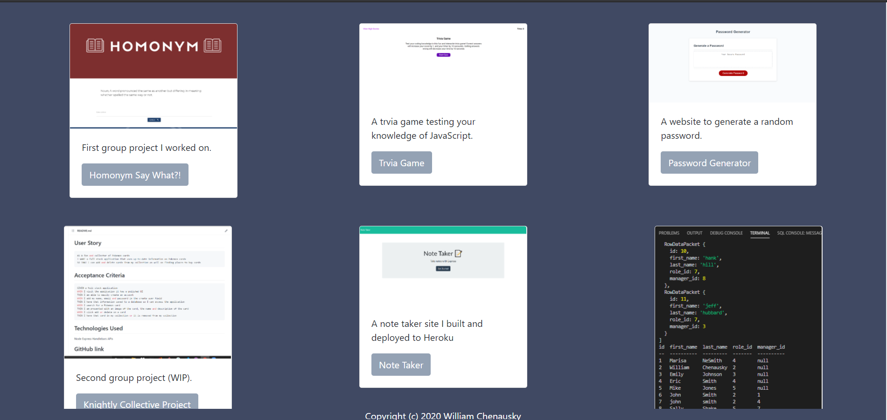
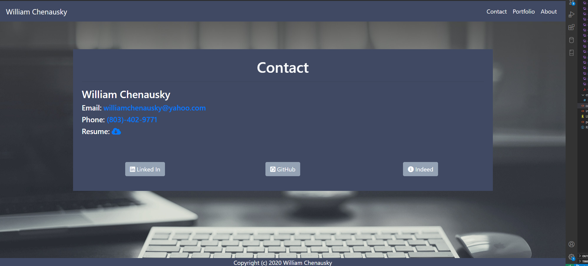
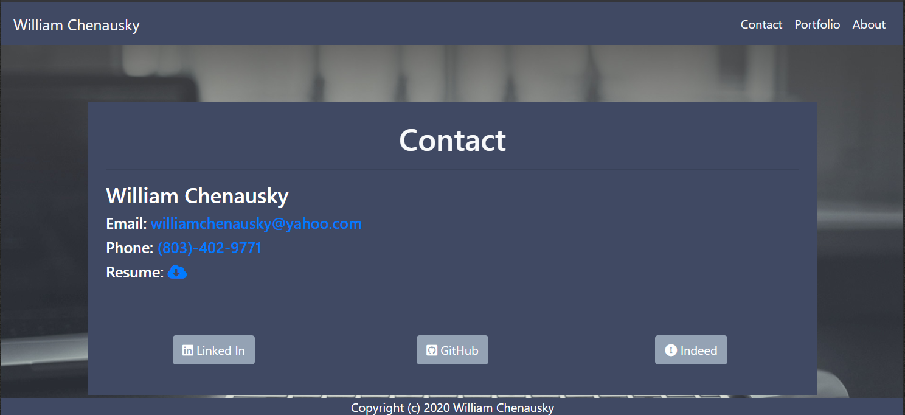

# Responsive Portfolio Updated

This is my updated Portfolio with links to my GitHub, Linked In, and Indeed profiles. Along with updated color scheme, and links showcasing the projects and homework assignments that I've been working on over the last few months. 

## Table of Contents  

* [Add Bootstrap Reference Links](#Add-Bootstrap-Reference-Links)  

* [Create a Responsive About Me Web Page](#Create-a-Responsive-About-Me-Web-Page)  

* [Create a Responsive Portfolio Web Page](#Create-a-Responsive-Portfolio-Web-Page)  

* [Create a Responsive Contact Web Page](#Create-a-Responsive-Contact-Web-Page)  

* [Credits](#Credits)  

* [License](#License) 

## Add Bootstrap Reference Links

1. Add Bootstrap Reference Links for CSS and JavaScript from (www.getbootstrap.com)

## Create a Responsive About Me Web Page

1. Use Bootsrap to create the About me web page.

### Desktop
  

### Tablet  
  

### Phone  

## Create a Responsive Portfolio Web Page

1. Use Bootstrap to create the Portfolio web page with updated projects and homework assinments.

### Desktop
  

### Tablet  
  

### Phone  

## Create a Responsive Contact Web Page

1. Use Bootstrap to create the Contact web page with updated Linked in, GitHub and Ineed Resume.

### Desktop
 

### Tablet  
  

### Phone  

* (https://github.com/wchenausky/responsive_portfolio)

* (https://wchenausky.github.io/responsive_portfolio/index.html)

## Credits

* Maris NeSmith (https://github.com/marisanesmith)  

* John Pendergrass (https://github.com/JohnWP8253)

## License

